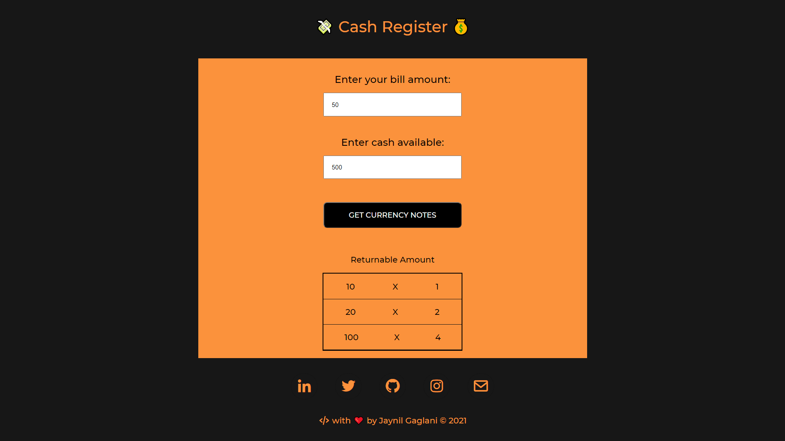

# Cash Register 💰

## Introduction

Cash Register maintains a list of currencies which provides the returnable amount to the user at the time of sell or purchase of products. I have employed `HTML, CSS, JavaScript, Flexbox` to design and develop this application.

## Live Demo

View the live demo of the application here 👉 [cash-register](https://jaynil-cash-register.netlify.app/)

## Application View

## Technologies Used

- HTML
- CSS
- JavaSript
- Flexbox layout

## Run Application

- Clone the repository
- Go to the cloned folder
- Run the `index.html` to get started

## 👤 **Jaynil Gaglani**

- Portfolio: [jaynil.gaglani](https://bit.ly/jaynil-profile)
- Linkedin: [Jaynil Gaglani](https://www.linkedin.com/in/jaynilgaglani/)
- Github: [@Jaynil1611](https://github.com/Jaynil1611)

## Show your support

Give a ⭐️ if you like this repository!

Made with ❤️ by Jaynil Gaglani
